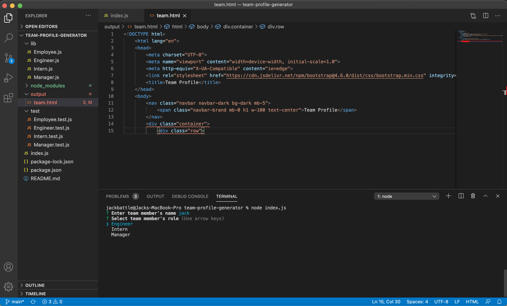

# team-profile-generator
For this assignment we were tasked with building a a command line interface for generating a team profile website with all their basic info. The technoloy we used was inquirer similar to the readme generator assignment, and jest for testing. 

Repoistory:
https://github.com/slimeforest/team-profile-generator

Youtube video:
https://www.youtube.com/watch?v=Rq3cBNmKVrA

IMAGES:

